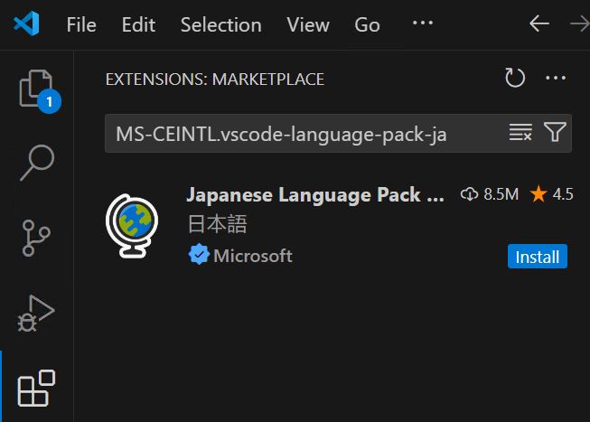
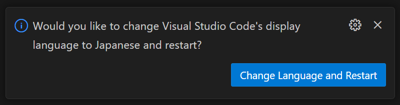

# 1-1. 環境構築

プログラミングをする上で役立つアプリケーションをインストールし、初期設定を行います。

## (macOSの人) Homebrewのインストール

Homebrewはパッケージマネージャーと呼ばれるmacOS向けのツールです。これを用いると、コマンドを1つ入力するだけで様々なアプリをインストールすることができるようになります。

ターミナルを開いて以下のコマンドをコピー&ペーストし、Enterを押して実行してください。

```sh
/bin/bash -c "$(curl -fsSL https://raw.githubusercontent.com/Homebrew/install/HEAD/install.sh)"
```

インストール時の注意事項

- パスワードの入力を求められた場合はMacへのログインに利用しているパスワードを入力してください。
- `Press RETURN/ENTER to continue or any other key to abort:` と表示されたらEnterキーを押してください。
- `Installation successful!` と表示されたらインストール終了です。
- `Run this(these two) command in your terminal to add Homebrew to your PATH:` と表示された場合は、その下に表示されているコマンドをコピー&ペーストして実行してからターミナルを開き直してください。

## Visual Studio Codeのインストール

Visual Studio Code(略称 VSCode)は、Microsoftが開発しているテキストエディタです。標準でインストールされているメモ帳のようなアプリでも開発は可能ですが、キーワードの色分け機能や自動補完といった様々な入力支援機能が利用できるため、Webに限らず様々な分野・様々なプログラミング言語を用いた開発に利用されています。

### Windowsの人

[ダウンロードページ](https://code.visualstudio.com/docs/?dv=win64user)を開くとインストーラーのダウンロードが開始されます。

ダウンロードが完了したらそのファイルを開いて実行し、画面の指示に従ってインストールを進めてください。

#### インストール時の注意事項

- `追加タスクの選択`画面ではすべての項目にチェックを入れておくことを推奨します。
- それ以外の画面はそのまま`次へ`で進んで問題ありません。
- `Visual Studio Code セットアップウィザードの完了`と表示されたらインストール終了です。`完了`を押してください。

### macOSの人

```sh
brew install visual-studio-code
```

## Gitのインストール

Gitは、ソースコードの変更履歴を記録するためのツールです。複数人が同じプロジェクトで作業する際などによく利用されます。複数人が同時に作業しても作業内容が衝突しない(衝突しても両方の履歴が残っているため解決できる)ような仕組みになっています。

### Windowsの人

[ダウンロードページ](https://gitforwindows.org/)を開き、Download ボタンを押すとインストーラーのダウンロードが開始されます。

ダウンロードが完了したらそのファイルを開いて実行し、画面の指示に従ってインストールを進めてください。

#### インストール時の注意事項

- `Choosing the default editor used by Git`画面では、`Use Visual Studio Code as Git’s default editor`を選択してください。
- `Adjusting the name of the initial branch in new repositories`画面では、`Override the default branch name for new repositories`を選択してださい。入力ボックスはmainのままにしてください。
- `Configuring the line ending conversions`画面では、一番下の`Checkout as-is, commit as-is`を選択してください。
  それ以外の画面はそのまま`Next`で進んで問題ありません。
- `Completing the Git Setup Wizard`と表示されたらインストール終了です。`Finish`を押してください。

### macOSの人

```sh
brew install git
```

## Visual Studio Codeの初期設定(日本語化)

Visual Studio Codeを開いて、 `Extensions` (拡張機能) を開いて検索欄に拡張機能名またはIDを入力し、 `Install` (インストール) を押してください。

- Japanese Language Pack for Visual Studio Code
    - ID: `MS-CEINTL.vscode-language-pack-ja`
    - VSCodeの表示を日本語化する拡張機能
    - インストール後、言語変更と再起動が提案されるので `Change Language and Restart` を押して日本語化する





これ以外にも後ほどいくつかの拡張機能をまとめてインストールします。


## Gitの初期設定

ターミナルを開き、以下のコマンドを実行します。なお、メールアドレスは大学のものでなくても構いません。また、名前も本名でなくても構いません。ただし実際には、開発を行う組織の方針が存在すればそれに従う必要があります。

```sh
git config --global user.email 自分のメールアドレス
git config --global user.name 自分の名前
```
