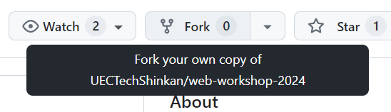
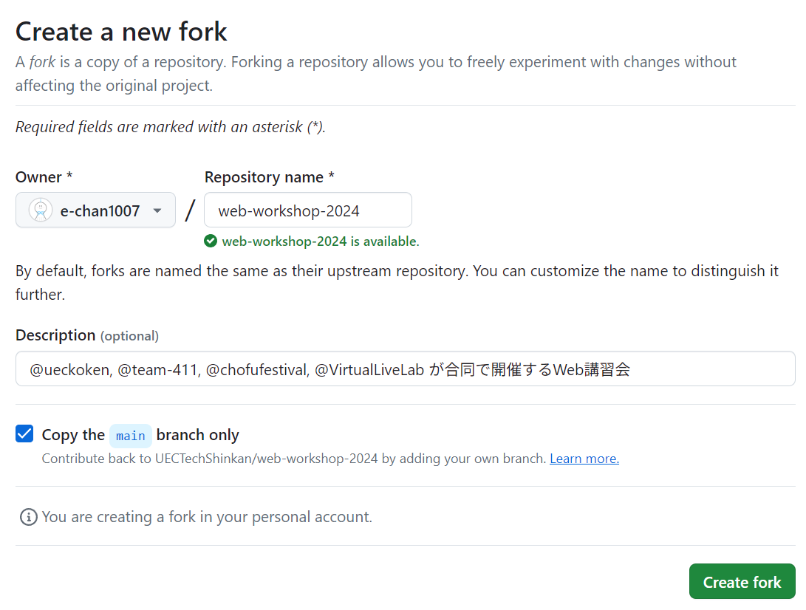
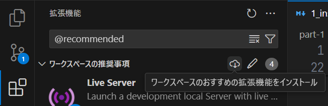
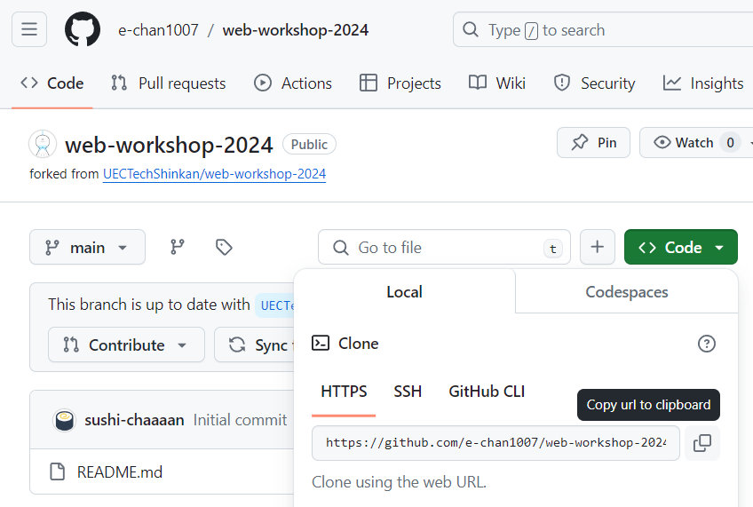
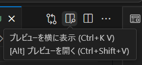

# 1-2. Gitを用いた講習用ファイルの準備

Gitは[第1節](./1_installation.md)で記載した通り、ファイルの変更履歴を管理するためのツール(バージョン管理システム)です。複数人での共同開発にもよく使われるツールですが、今回の講習では1人での使用を想定して基本的な機能に絞って説明をします。

はじめに、このあとの作業を進めるうえで先に知っておくべき単語を2つ紹介します。

## リポジトリとは

一般に、ソースコードはプロジェクトごとに用意したディレクトリ内に格納します。このようにソースコードを格納する場所のことをGitではリポジトリ(repository)と呼びます。例えば、この講習資料が格納されているリポジトリには、`web-workshop-2024`という名前がつけられています。

リポジトリ内には変更履歴などを記録する隠しディレクトリ(`.git`)が存在しますが、基本的にはこれを**手動で変更すべきではありません**。

リポジトリには、手元のPC(ローカル環境)に保存されている**ローカルリポジトリ**と、GitHubのようなインターネット上のリポジトリ共有サービスのサーバーに保存されている**リモートリポジトリ**の2種類があります。

## GitHubとは

GitHubは、GitHub社(Microsoftの傘下)が提供するGitのリポジトリをアップロードできるサービスの名称です(ソースコードをホスティングするプラットフォームとも言われる)。Gitのリポジトリ管理機能の他にも、開発を支援するための様々な機能が利用できます。

BitbucketやGitLabといったサービスも他社が提供する似たサービスですが、ここではGitHubを採用します。


---

ここからは、Gitを用いて実際に開発準備をしながらGit・GitHubの機能を解説していきます。
なお、この先の作業は、[第1節](./1_installation.md)で環境構築が完了していること、GitHubのアカウントを作成していることが前提となります。
GitHubのアカウントを持っていない場合は、[こちら](https://github.com/signup)からアカウントを作成してください。


## 講習用リポジトリのフォーク

講習用のリポジトリは、[`web-workshop-2024`](https://github.com/UECTechShinkan/web-workshop-2024)です。ただし、このリポジトリの編集権限は資料の作成者のみにあるため、このリポジトリを講習を受けている皆さん自身ののGitHubアカウントにコピーして、リポジトリ内のファイルを編集できるようにします。
この操作を「リポジトリを**フォーク**(fork)する」と呼びます。

リポジトリをフォークするには、リポジトリの[トップ画面](https://github.com/UECTechShinkan/web-workshop-2024)を開き、右上にある`Fork`ボタンを押します。



次の画面では、フォーク先のアカウントやリポジトリ名などを選択できます。デフォルトのままで問題がなければそのまま`Create fork`ボタンを押してください。



しばらく待つと、フォークが完了して新しく作成されたリポジトリのトップ画面に移動します。
この先の作業は、このフォークしたリポジトリを使って進めていきます。

なお、GitHubではリポジトリを`所有者名/リポジトリ名`という形式で表現します。フォークしたリポジトリは、元のリポジトリの所有者名(`UECTechShinkan`)の部分が自分のGitHubアカウント名に変わっていることを確認してください。
以降は、フォーク後のリポジトリを`your-account/web-workshop-2024`と表記します。




## 開発用リポジトリのクローン

作成したフォークを手元のローカル環境にダウンロードして、開発を進めるための準備をします。

まずは、開発用のディレクトリ(フォルダー)を用意してください。このとき、ディレクトリ名には**日本語をはじめとする全角文字を使わない**ように注意してください[^1]。

[^1]: プログラミング系のツール群は、ファイルやディレクトリの名称に全角文字を使った場合に不具合を起こす場合があります。

「sources」「development」「dev」「programming」など、自分にとってわかりやすい名前をつけましょう。

次に、ターミナルを開いてそのディレクトリへ移動します。

```sh
cd ディレクトリのパス
```

ホームディレクトリの下に「sources」ディレクトリを作成した場合は、

```sh
cd ~/sources
```

のように指定すると良いでしょう(`~/`はホームディレクトリを指す)。

このディレクトリの下に、講習用リポジトリ`your-account/web-workshop-2024`をダウンロードします。
リモートリポジトリをダウンロードしてローカルリポジトリを作成することを、「リポジトリをクローン(clone)する」と言います。
クローンのためにはクローン元となるリモートリポジトリのURLが必要になります。

先ほどフォークしたリポジトリのトップ画面を開いて、緑の `Code` を押すとURLが表示されているので、その右のボタンを押してURLをコピーします。



再びターミナルに戻り、以下のようにコマンドを実行してください。

```sh
git clone <リモートリポジトリのURL>
```

このとき、`<リモートリポジトリのURL>`の部分は、先ほどコピーしたURLを使い、
```sh
git clone https://github.com/your-account/web-workshop-2024.git
```
のように入力してください。

これを実行すると、先ほど作成した開発用ディレクトリの中にさらに`web-workshop-2024`というディレクトリが作成され、リポジトリの内容が複製されます。

講習資料もこのリポジトリ内に含まれているため、以降は手元の環境でも講習資料を参照しながら作業を進めることができます。

講習資料を開くとそのソースコードが表示されるため、見た目が異なり様々な記号も表示されています。ソースコードではなく整形表示されたプレビューが見たいときは、画面右上のプレビューを開くボタンを押してください。


