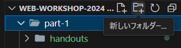
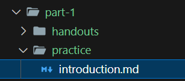
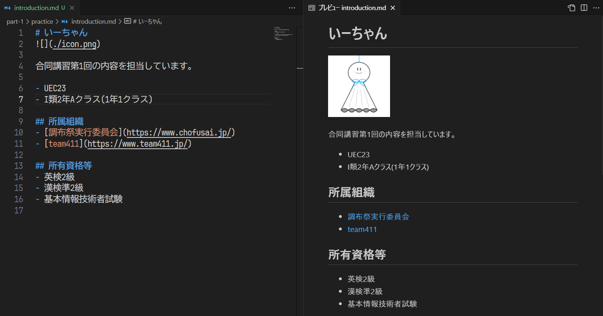

# 1-3. 実際にMarkdownを書いてみよう

まずは今回の講習で何回か出てきたMarkdownについて紹介します。

Markdownは、文章を記述するための言語で、読みやすく書きやすい簡潔さが特徴の言語です。開発の場面では技術文書やREADME(はじめにお読みください)ファイルなどでよく用いられています。
MarkdownはHTMLに変換して使われることも多く、ブログ記事がMarkdownで記述されていることもあります。
また、よく使われているDiscordやNotionなどのツールもMarkdownの記法に対応している場合があります。
この講習資料もMarkdownを用いて記述されています。

さて、実際にMarkdownファイルを記述してみましょう。
`web-workshop-2024/part-1/practice/`ディレクトリ作成してください。

(なお、これ以降の資料では `web-workshop-2024` の部分を省略し、`/part-1/practice/` のように記述します。)

上部の新しいフォルダボタン、もしくはディレクトリを右クリックしても作成することができます。
なお、場合によっては`part-1/handouts`のようにディレクトリ名がまとめられて表示されることがありますが、その場合は`part-1`の部分にカーソルを合わせて右クリックし、新しいフォルダを作成してください。

続いて、`/part-1/practice/introduction.md` を作成してください。

[付録のMarkdown記法](./a1_markdown-syntax.md)を参考にしながら、自己紹介のファイルを作成してみましょう。

内容は自由ですが、以下の要素を含めて記述してください。

- 見出し
- 他サイトへのリンク
- 画像
- 箇条書き

[第2節](./2_prepare-files.md)でも触れたように、プレビュー機能を使うと、Markdownの記述内容をリアルタイムで確認することができます。

