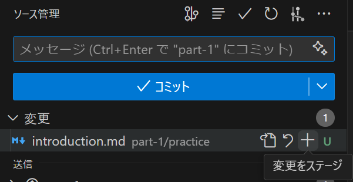
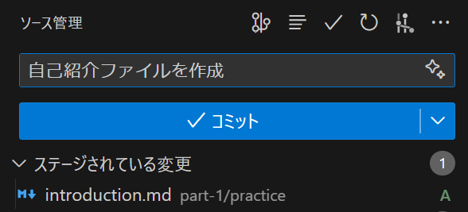
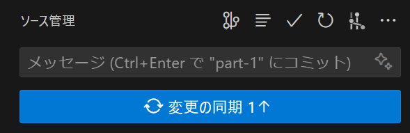

# 1-4. 変更履歴をコミット・プッシュしよう
第1回の最後に、変更履歴を保存してみましょう。

Gitを用いて変更履歴を保存することを「**コミット**(commit)」と言います。

通常通りファイルを保存した後、ターミナルで以下のコマンドを実行します。

```sh
git add 変更履歴を保存するファイルのパス
git commit -m "コミットメッセージ"
```

`git add`コマンドで変更履歴に追加するファイルを指定します。
これを「**ステージ**(stage)する」と言います。

`git commit`コマンドで実際に変更履歴を保存します。
`-m`オプションの後には、そのコミットについての説明文を書きます。このメッセージは他の人が変更履歴を見たときに、その変更内容が一目でわかるように簡潔に書くようにしましょう。

```sh
git add ./part-1/practice/introduction.md
git add ./part-1/practice/icon.png
git commit -m "自己紹介ファイルを作成"
```

このようにすることで、変更履歴が保存されます。
なお、現在のディレクトリ以下で、変更されたファイルの変更履歴をすべて保存する場合は、それぞれのファイル名を指定する代わりに `git add .` とすることで、変更履歴をすべて保存することができます。

```sh
git add .
git commit -m "自己紹介ファイルを作成"
```

次に、変更履歴をリモートリポジトリにアップロードします。これを「**プッシュ**(push)」と言います。

```sh
git push -u origin main
```

`git push`コマンドで変更履歴をリモートリポジトリにアップロードします。

`origin`は既定で設定されるリモートリポジトリを示す名前、`main`は既定で設定されるブランチ名です。

Gitには、ブランチ(branch)という概念があり、変更履歴を分岐させるために使われます。複数人が別々のブランチで作業を行い、それを統合することで、同じリポジトリで複数人が同時に作業することができます。

この講習では簡略化のために、`main`ブランチを使って作業を進めますが、実際の開発では複数のブランチを使い分けることが一般的です。

`-u`オプションは、次回以降のプッシュでリポジトリ・ブランチ名の指定を省略できるようになる設定です。初回のみ`-u`オプションを付けて実行してください。

これで、変更履歴がリモートリポジトリにアップロードされました。

GitHubのリポジトリページを開いて、変更履歴が反映されていることを確認してみましょう。

---

以上の作業は、コマンドを入力せずにVSCode上で実行することもできます。

画面左端のメニューから、`ソース管理`パネルを開きます。

変更したファイルが一覧表示されるので、コミットしたいファイルに対して`変更をステージ`します(`git add`と同等の操作)。



ファイルをステージしたら、上部のメッセージ欄にコミットメッセージを入力し、`コミット`を押します(`git commit`と同等の操作)。



最後に、`変更の同期`を押すことでリモートリポジトリに変更履歴がプッシュされます(`git push`と同等の操作)。


