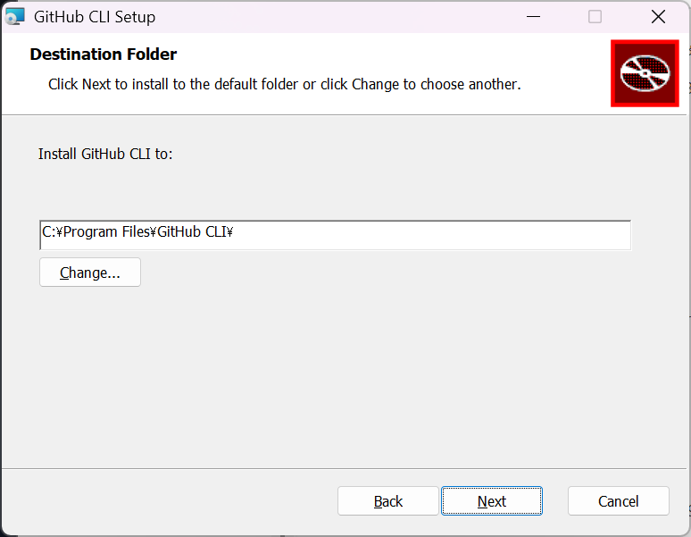
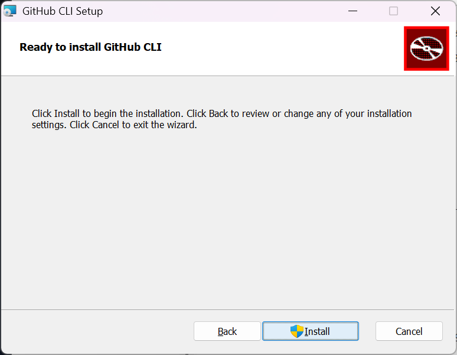
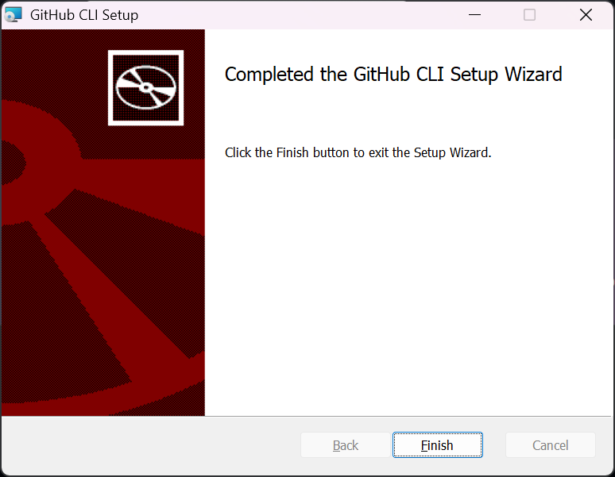
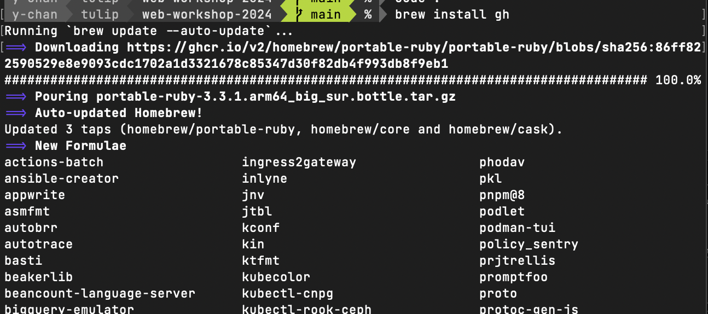
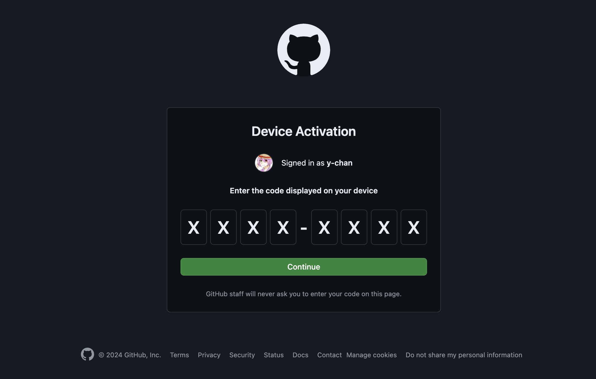
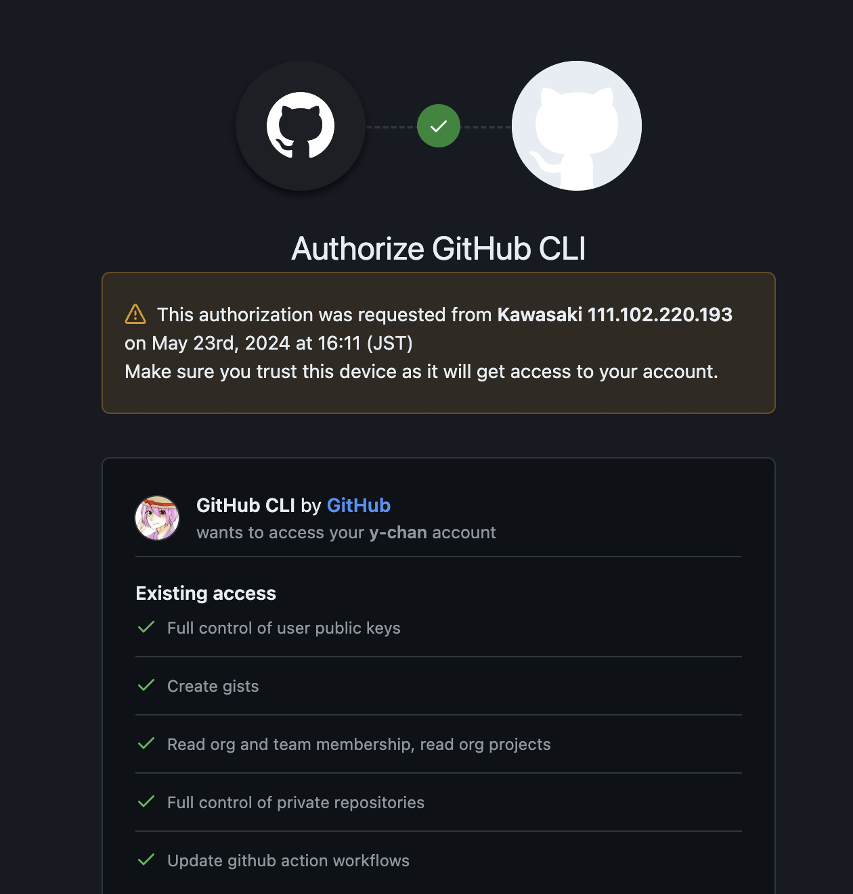

# 0. GitHub CLI (`gh`コマンド)をインストール・セットアップする

GitHub CLI (`gh`コマンド)を使うと、GitHubの機能をコマンドラインから利用できます。リポジトリの作成やクローン、プルリクエストの作成など、GitHubの操作を効率的に行うことができます。
また、`git`コマンドの、GitHub向けの設定を自動で行ってくれるため、GitHubとの連携がスムーズになります。

## インストール方法

### Windowsの人

[ダウンロードページ](https://cli.github.com/)を開き、Download for Windowsボタンより、インストーラーをダウンロードします。


ダウンロードしたインストーラーを実行し、指示に従ってインストールを行ってください。
以下のような画面をNext、Next、インストールと進めていくだけでインストールが完了します。








<p style="font-size: 1.25rem; font-weight: bold">インストールが終わったらPCを再起動してください。</p>

### macOSの人

第1回の講習でHomebrewをインストールしていると思うので、ターミナルで以下のコマンドを実行してGitHub CLIをインストールします。

```sh
brew install gh
```



<p style="font-size: 1.25rem; font-weight: bold">コマンドが実行し終わったらPCを再起動してください。</p>

## ghコマンドのセットアップ

`gh`コマンドを使うためには、GitHubにログインする必要があります。ターミナルから、以下のコマンドを実行して、GitHubにログインしてください。

```sh
gh auth login
```

普通のGitHubを使うので、カーソル(`>`記号)を`GitHub.com`にした状態でエンターキーを入力してください。デフォルトでGitHub.comが選択されていると思います。

```sh
? What account do you want to log into?  [Use arrows to move, type to filter]
> GitHub.com
  GitHub Enterprise Server
```

コンリテでも少し習ったかもしれませんが、`ssh`という手法でGitHubにアクセスすることができます。`ssh`の方がセキュリティ的に良いので、上下キーでカーソルを`SSH`に合わせ。エンターキーを入力してください。

```
? What is your preferred protocol for Git operations on this host?  [Use arrows to move, type to filter]
  HTTPS
> SSH
```

もし、ssh鍵を生成したことがなければ、以下のように聞かれます。`y`を入力し、エンターしてください。
次に、ssh鍵のパスフレーズを設定するか聞かれます。設定する必要はありませんので、エンターしてください。

```sh
? Generate a new SSH key to add to your GitHub account? (Y/n) y
? Enter a passphrase for your new SSH key (Optional)
```

ssh鍵を生成したことがある場合は、以下のように聞かれます。
アップロードするキーを選択してください。`~/.ssh/id_rsa`などがデフォルトで選択されていると思います。

```sh
? Upload your SSH public key to your GitHub account?  [Use arrows to move, type to filter]
> ~/.ssh/id_rsa.pub
  Skip
```

次に、GitHubにssh鍵を登録するときの、名前を聞かれます。デフォルトで`GitHub CLI`になりますが、名前を変更したい場合は名前を入力し、エンターしてください。

```sh
? Title for your SSH key: (GitHub CLI)
```

最後に、GitHubにログインするように促されます。
`Login with a web browser`でエンターキーを入力してください。

```sh
? How would you like to authenticate GitHub CLI?  [Use arrows to move, type to filter]
> Login with a web browser
  Paste an authentication token
```

ワンタイムパスコードが表示されます。コピーしてください。
次に、指示通りエンターを押してください。ブラウザーが開かれ、GitHubにログインする画面が表示されます。

```
! First copy your one-time code: XXXX-XXXX
- Press Enter to open github.com in your browser...
```

先ほど表示されたワンタイムパスコードを貼り付け、エンターキーか、Continueボタンを押してください。


Authorize GitHub CLIと表示されます。
下にスクロールし、authorize githubボタンを押してください。




あとは、指示に従い、GitHubにログインしてください。

ターミナルで以下のような表示がでていれば、ログイン成功です。

```
Press Enter to open github.com in your browser...
✓ Authentication complete.
- gh config set -h github.com git_protocol ssh
✓ Configured git protocol
✓ Logged in as y-chan
```
