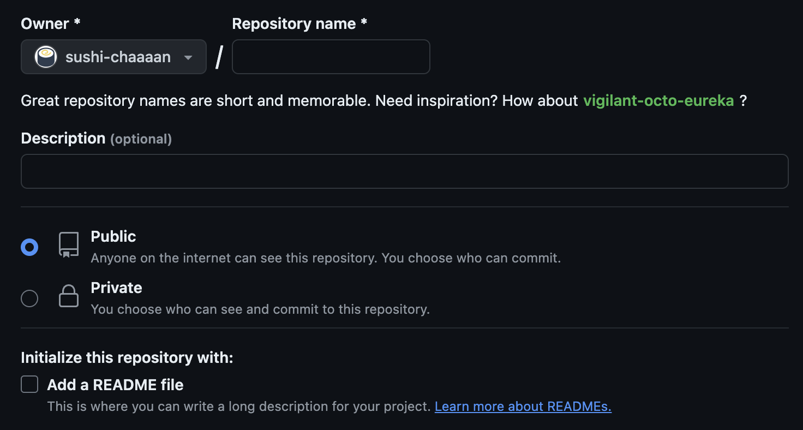
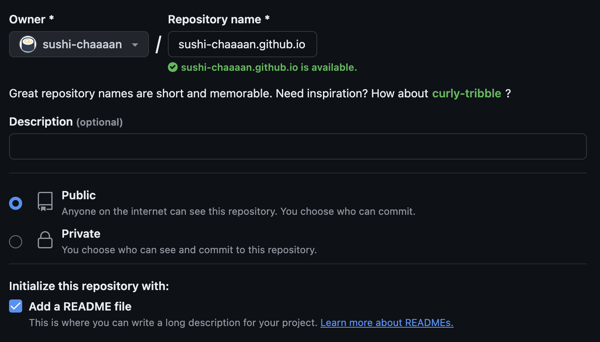
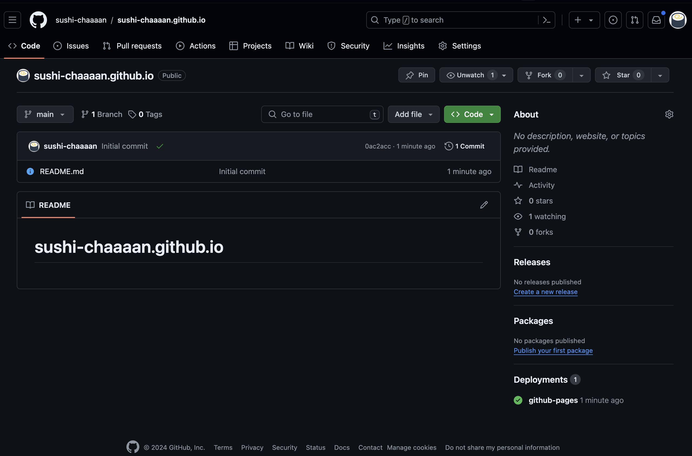
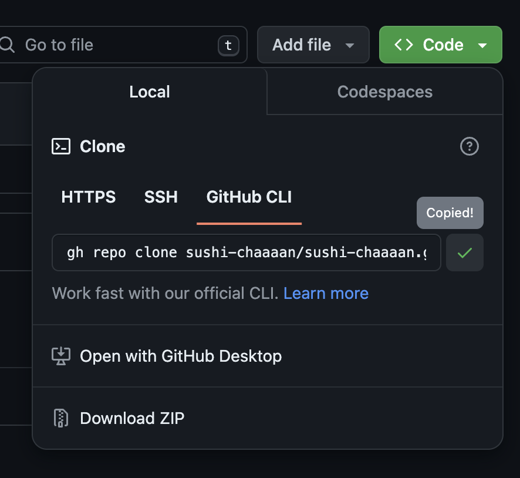

# 2. GitHub Pagesの準備

ここからは、実際にHTMLを書く演習を通してHTMLに慣れていきます。最終的には簡単なWebページを作成し、GitHub Pagesを使って公開します。

まずはGitHub Pagesの準備をします。GitHub Pagesは、リポジトリにHTMLファイルを置くだけでWebページを公開できる便利な機能です。

## 2.1 リポジトリの作成

1. <https://github.com/new>にアクセスします。
2. 下の画像のようなUIが表示されるので、<br>
   1. Repository Nameに`[あなたのGitHubユーザー名].github.io`と入力します。<br>`[あなたのGitHubユーザー名]`には通常Ownerに指定されたユーザー名と同じものを当てはめますが、**ユーザー名に大文字が含まれる場合はそこを小文字に変換してください。**
   2. 下部のInitialize this repository with:にある`Add a README file`にチェックを入れます。
3. 下の画像のようになっていればOKです。他の部分は変更せず、ページを下までスクロースして「Create Repository」をクリックします。<br>

## 2.2 リポジトリをGitHub CLIでクローン

リポジトリの作成が完了したらリポジトリのページに自動的に移動します。



中央にある緑色のCodeボタンをクリックし、**GitHub CLI**を選択して`gh repo clone`から始まるコマンドをコピーします。



ターミナルを開いて、[前回](../../part-1/handouts/2_prepare-files.md#開発用リポジトリのクローン)作成したディレクトリに移動してください。

> [!TIP]
> このディレクトリは、通常
> Windowsであれば`C:/Users/{ユーザー名}`、
> macであれば`/Users/{ユーザー名}`
> の中にあるはずです。

移動できたら、先ほどコピーしたコマンドを貼り付けます。これは通常下のようになっています。

```bash
gh repo clone [GitHub UserName]/[GitHub UserName].github.io
```

確認できたら実行します。前回と同じような出力が出ると思います。

```bash
$ gh repo clone sushi-chaaaan/sushi-chaaaan.github.io
Cloning into 'sushi-chaaaan.github.io'...
remote: Enumerating objects: 3, done.
remote: Counting objects: 100% (3/3), done.
remote: Total 3 (delta 0), reused 0 (delta 0), pack-reused 0
Receiving objects: 100% (3/3), done.
```

done.と表示されたら前回と同様にVSCodeでディレクトリを開いてください。

> [!IMPORTANT]
> これ以降、講習資料のリポジトリとGitHub Pagesのリポジトリは両方開いた状態で講習を進めていきます。
