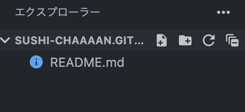
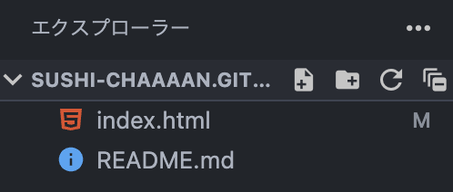
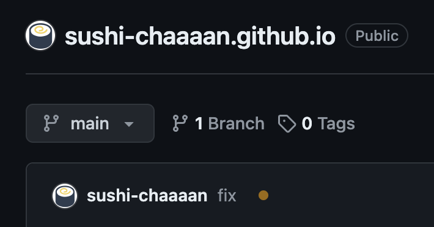
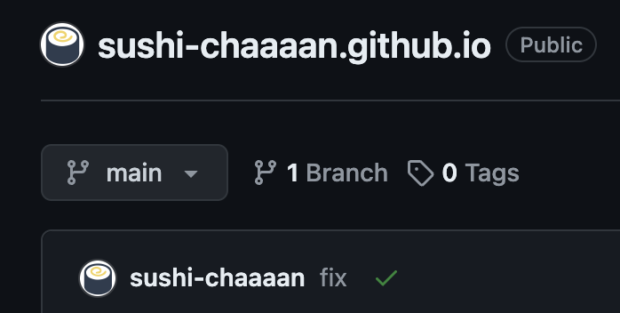
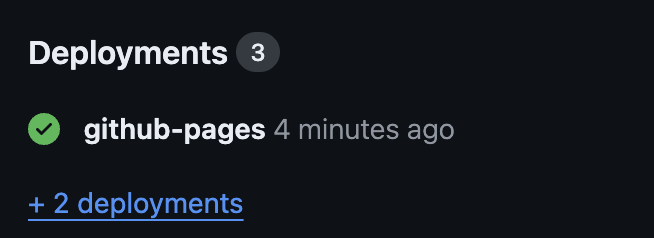
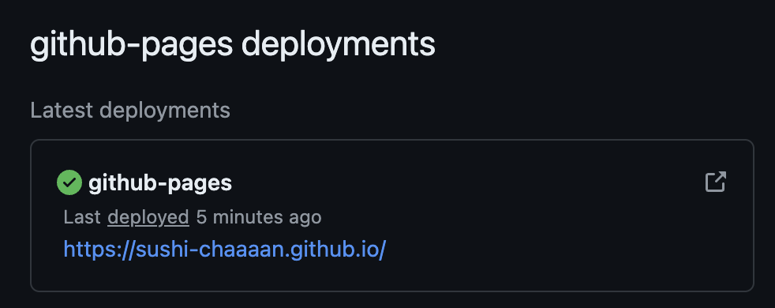
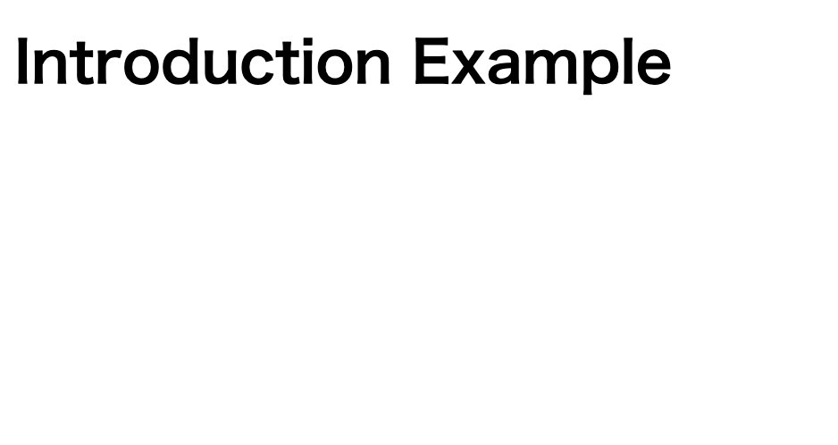

# 3. HTMLを書いていこう

## 3.1 トップページを追加してみよう

### 3.1.1 トップページのファイルを作成しよう

[GitHub Pagesの準備](./2_prepare_pages_repo.md)で作成したリポジトリを開くと下の画像のようになっていると思いましう。ここに`index.html`というファイルを作成してください。



> [!TIP]
> 上の画像の一番左にあるボタンをクリックするとファイルの新規作成が始まるので、
> `index.html`と入力してEnterを押してください。

画像のように`index.html`が増えていればOKです。



`index.html`を開いて、下のコードを貼り付けてください。

```html
<!doctype html>
<html lang="ja">
  <head>
    <meta charset="UTF-8" />
    <meta name="viewport" content="width=device-width, initial-scale=1.0" />
    <title>[ここにあなたのGitHubユーザー名を入力]</title>
  </head>
  <body>
    <h1>[ここにあなたのGitHubユーザー名を入力]'s page</h1>
  </body>
</html>
```

その後、\[ここにあなたのGitHubユーザー名を入力\]の部分をあなたのGitHubユーザー名に置き換えてください。

これでトップページが一旦できたので、[第1回の内容](../../part-1/handouts/4_commit.md#1-4-変更履歴をコミットプッシュしよう)を参考にしてコミット・プッシュしてください。

### 3.1.2 GitHub Pagesの更新を確認しよう

コミットできたら、ブラウザでGitHubを開いて[先ほど作成](./2_prepare_pages_repo.md#21-リポジトリの作成)したリポジトリのトップページにアクセスしてみてください。

正常にプッシュできていれば、黄色い丸が表示されています。実はGitHub Pagesは変更内容をコミットしてプッシュするたびに勝手にWebサイトの内容を更新してくれます。



1〜2分程待ってページを再読み込みすると、下の画像のように黄色だったマークが緑のチェックボックスに変わっているはずです。



緑のチェックボックスが表示されたら、リポジトリのトップページにアクセスしてみてください。

右側の部分にDeploymentsという項目があるのですが、



その中にある`github-pages`をクリックしすると`github-pages deployments`という項目があるので、そこに表示されている`github.io`で終わるURLにアクセスすると、先ほど作成した`index.html`の内容が表示されていたら成功です。



<p style="font-size: 1.5rem; font-weight:700;">おめでとうございます！
<br>あなたはたった今自分のWebページを公開しました</p>

## 3.2 ページを増やしてみよう

トップページだけでは寂しいので、もう1ページ追加してみましょう。

`index.html`と同じ階層に`introduction.html`というファイルを作成して下の内容をコピーしてください。

```html
<!DOCTYPE html>
<html lang="ja">
  <head>
    <meta charset="UTF-8" />
    <meta name="viewport" content="width=device-width, initial-scale=1.0" />
    <title>Introduction</title>
  </head>
  <body></body>
</html>
```

[第1回の途中で](../../part-1/handouts/3_write-markdown.md#1-3-実際にmarkdownを書いてみよう)Markdownを使った自己紹介を書いてもらったと思います。

**実はMarkdownはHTML相当の記述を効率よく書くための言語なので、HTMLに変換することができます。**

ということで、[HTMLとMarkdownの対応表](./a2_html_tag_and_markdown.md)を用意したので、これを参考にしながら`introduction.html`にHTML版の自己紹介を書いてみてください。

> [!TIP]
> [1章で使ったプレビュー機能](./1_what_is_html.md#13-実際のhtmlを読んでみよう)を使いながら編集することをおすすめします。編集内容をリアルタイムで確認できます。

## 3.3 リンクを張ってみよう

[2. ページを増やしてみよう](#32-ページを増やしてみよう)で自己紹介のページを作成しました。せっかくなのでトップページから自己紹介ページに移動できるようにしてみましょう。

HTMLでは、`<a>`要素を使うことでリンクを作成することができます。

`<a>`要素は`href`属性にリンク先のURLを指定することで、そのリンク先に飛ぶことができます。今回は同じディレクトリにある`introduction.html`にリンクを張りたいので、`href`属性に`/introduction.html`を指定します。

`index.html`を開いて、`<body>`要素内のどこかに下のコードを追加してください。

```html
<a href="/introduction.html">My Introduction</a>
```

これでトップページに自己紹介ページへのリンクが追加されました。

## 3.4 GitHub Pagesを更新しよう

ここまでできたら、[第1回の内容](../../part-1/handouts/4_commit.md#1-4-変更履歴をコミットプッシュしよう)を参考にしてコミット・プッシュしてください。

あとは更新できるまで待って、[先程と同様](#312-github-pagesの更新を確認しよう)の手順でGitHub Pagesにアクセスすると、自己紹介へのリンクが表示されているはずです。


クリックして自己紹介が表示されたら成功です。



<p style="font-size: 1.5rem; font-weight:700;">おめでとうございます！
<br>あなたはたった今自分のWebページにリンクを追加しました</p>

## 3.5 おわりに

お疲れ様でした！ここまで来たあなたは、自分のWebページを作成して自由にページとコンテンツを追加できるようになりました。

次回からは、CSSを使ってこのページのデザインを整えたりする方法を学んでいきます。

それでは、次回もよろしくお願いします！
