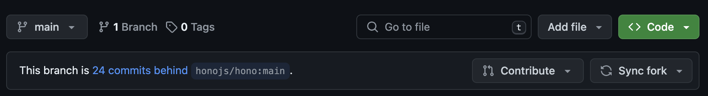
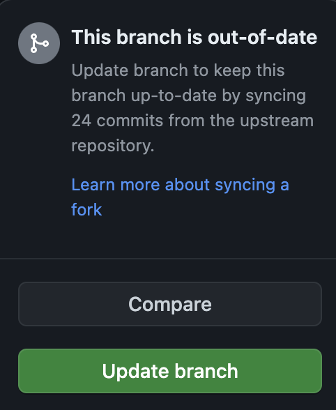
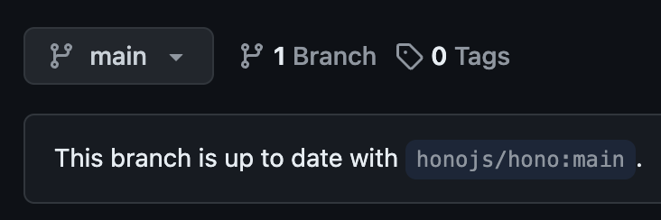
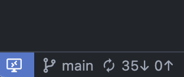

# 最初に: 前回フォークしたリポジトリを更新しましょう

おそらく第1回の中で[この講習のリポジトリ](https://github.com/UECTechShinkan/web-workshop-2024)をフォークしていただいたと思います。

その時点では第2回の資料が含まれていなかったため、皆さんがフォークしたリポジトリには第2回の資料が含まれていません。

そのため、まずはフォークしたリポジトリを更新しましょう。

## フォークしたリポジトリの更新

1. フォークしたリポジトリのトップ画面にアクセスします。通常、`https://github.com/{あなたのGitHubユーザー名}/web-workshop-2024`のようなURLでアクセスできます。
2. リポジトリのトップページの中央に画像のような表示があると思います。 
3. 右側にあるグレーの「Sync fork」ボタンをクリックします。
4. 画像のようなUIが表示されたら、「Update branch」ボタンをクリックします。 
5. 自動的にページが再読み込みされます。その後、2.で見た部分が下の画像のようになっていれば完了です。 

## VSCodeに更新を反映

最後に、前回フォークしたリポジトリのフォルダをVSCodeで開いてください。

左下に画像のような`<数字>↓0↑`の表示が出ていると思うので、クリックするとGitHub上の最新のコードがVSCodeに反映されます。

> [!TIP]
> この操作は内部的に`git pull`というコマンドを実行しています。
