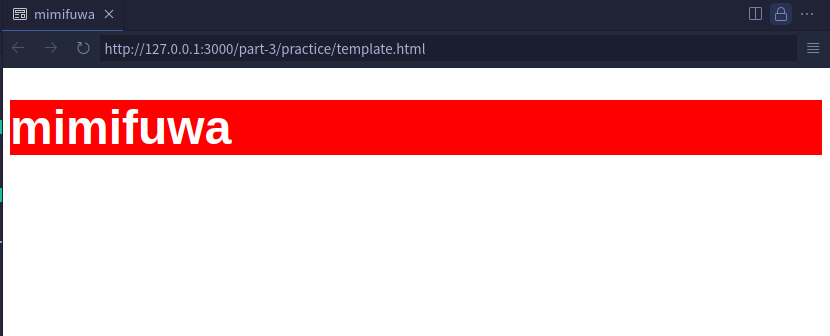

# スタイルシート（CSS）

## 内部スタイルシート

前節では、`style` 属性を用いて HTML 要素のスタイリングを行いました。
ここでは、CSS（カスケーディングスタイルシート） を用いて複数の要素に同じスタイルを指定する方法を学びます。

### CSS を用いるメリット

`style` 属性を使用した場合、その要素のみにしかスタイルを指定することができませんでした。

この場合、全く同じスタイリングを他の要素にも行う必要があり、効率が悪くなってしまいます。

例えば、「`p` タグ全てに文字を赤くする」というスタイルを指定する場合、`style` 属性を使用すると、以下のようになってしまいます。

```html
<p style="color: red">段落1</p>

<p style="color: red">段落2</p>

<p style="color: red">段落3</p>

<p style="color: red">段落4</p>
```

これはあまり効率が良くなく、「`p` タグの色を赤ではなく青に変えたくなった」のようなときに編集することも大変です。

そこで、スタイルシートを使用します。これにより、複数の要素に同じスタイルを指定でき、再利用性が高まり、メンテナンスも容易になります。

### CSS の書き方

スタイルシートのうち、ここでは「内部スタイルシート」について紹介します。

HTML 文書の`<head>`の内部に`<style>`タグを使用して記述します。

例をみて確認しましょう。

```html
<!DOCTYPE html>
<html lang="ja">
  <head>
    <meta charset="UTF-8" />
    <meta name="viewport" content="width=device-width, initial-scale=1.0" />
    <title>内部スタイルシートの例</title>
    <style>
      body {
        background-color: lightblue;
      }
      h1 {
        color: navy;
        text-align: center;
      }
      p {
        font-size: 20px;
        color: red;
      }
    </style>
  </head>
  <body>
    <h1>Hello World!</h1>
    <p>CSSを使うことで要素を修飾できます。</p>
  </body>
</html>
```

`style` タグの中ではこのように記述をします。

「セレクタ」には、`h1`、`p` といったタグ名、後述するクラス名、ID 名などを指定します。

プロパティと値については、前節で紹介した構文と同様です。

```css
セレクタ {
  プロパティ: 値;
  プロパティ: 値;
  ...;
}
```

`p` タグの文字サイズを `20px` 、文字色を 赤（`red`）に指定したい場合、

```css
p {
  font-size: 20px;
  color: red;
}
```

> [!TIP]
>
> 複数の異なる要素に、同じスタイルを指定したいときは、以下のように、セレクタをカンマで区切ります。
>
> ```css
> h1,
> p {
>   color: red;
> }
> ```

のように記述します。

### 実践

前節で書いた `h1` タグの `style` 属性に指定した、`color: white; background-color: red;` を、内部スタイルシート で記述してみましょう。

一旦、`style` 属性を消して、

```html
<!DOCTYPE html>
<html lang="ja">
  <head>
    <meta charset="UTF-8" />
    <meta name="viewport" content="width=device-width, initial-scale=1.0" />
    <title>[ここにあなたのGitHubユーザー名を入力]</title>
  </head>
  <body>
    <h1>[ここにあなたのGitHubユーザー名を入力]'s page</h1>
  </body>
</html>
```

以下のように、`style` タグを追加して、中身を記述します。

今回は `h1` 要素にスタイルを適応したいため、セレクタを `h1` とします。

```html
<!DOCTYPE html>
<html lang="ja">
  <head>
    <meta charset="UTF-8" />
    <meta name="viewport" content="width=device-width, initial-scale=1.0" />
    <title>[ここにあなたのGitHubユーザー名を入力]</title>
    <style>
      h1 {
        color: white;
        background-color: red;
      }
    </style>
  </head>
  <body>
    <h1>[ここにあなたのGitHubユーザー名を入力]'s page</h1>
  </body>
</html>
```

先ほどと同様に、赤い背景に白文字で表示されたと思います。



### 練習問題

それでは練習問題をやってみましょう。

Q. 以下のうち、正しい CSS の書き方はどれでしょうか？

<hr>

A.

```css
body = {
  background-color: red;
  font-size: 32px;
}
```

B.

```css
h1 {
  color: white
  font-size: 10px
}
```

C.

```css
h2 {
  background-color: black;
  color: white;
}
```

D.

```css
p {
  font-size: 24px;
  color: green;
```

<hr>
<br>

<details>
  <summary>A. が解答だと思ったらクリック</summary>
   間違いです。イコール（=）が不要です。
</details>
<br>

<details>
  <summary>B. が解答だと思ったらクリック</summary>
   間違いです。セミコロン（;）が抜けています。複数のスタイルプロパティを区切るにはセミコロンが必要です。
</details>
<br>

<details>
  <summary>C. が解答だと思ったらクリック</summary>
   正解です！正しく理解できていますね！
</details>
<br>

<details>
  <summary>D. が解答だと思ったらクリック</summary>
   間違いです。閉じ括弧（}）が抜けています。
</details>
<br>

<br>

これでスタイルを使い回せるようになりました！

## 外部スタイルシート

... が、人間というもの欲がでてくるので、もっと使い回せるようにしたくなるわけです。

そこで、ここではスタイルシート（CSS）を外部ファイルに切り分ける方法について紹介します。

HTML の文書内でスタイルシートを読み込むには、以下を使用します。

```html
<link rel="stylesheet" href="CSSファイルへのパス" />
```

### 実践

そんなに難しいことはないので、早速実践です。

まず、`style.css` という名前のファイルを HTML ファイルと同じ階層に作成します。
（実は名前は何でもいいです）

次に、先ほど編集した HTML ファイルの `style` タグの中身を、`style.css` の中に移植します。

```css
@charset "UTF-8";

h1 {
  color: white;
  background-color: red;
}
```

> [!TIP] > `@charset "UTF-8"` は
> 「UTF-8」という文字コードでこの CSS ファイルを読み込む、ということを意味します。
>
> 書かなくても動きますが、日本語をファイルの中で使用した場合などに動かなくなることがあるので、書くことをおすすめします。

このファイルを HTML ファイルの中で読み込みます。

```html
<!DOCTYPE html>
<html lang="ja">
  <head>
    <meta charset="UTF-8" />
    <meta name="viewport" content="width=device-width, initial-scale=1.0" />
    <title>[ここにあなたのGitHubユーザー名を入力]</title>
    <link rel="stylesheet" href="./style.css" />
  </head>
  <body>
    <h1>[ここにあなたのGitHubユーザー名を入力]'s page</h1>
  </body>
</html>
```


外部 CSS ファイルを読み込んでスタイルを各要素に適用することができました！
