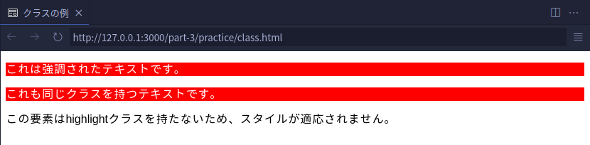

# クラスと ID について

CSS では、クラスと ID というものを使って HTML 要素にスタイルを適用することができます。

ここでは、クラスと ID の特徴、その使い方について学びます。

（以下、見やすさのため内部スタイルシートを使って解説しますが、外部スタイルシートを使ってもらっても大丈夫です）

## クラス

### 特徴

- クラスは `class` 属性を使って HTML 要素に指定します
- 複数の HTML 要素に同じクラスを適用できます
- クラスセレクタは `.`（ピリオド）で始めます

### 使用例

```html
<!DOCTYPE html>
<html lang="ja">
  <head>
    <meta charset="UTF-8" />
    <meta name="viewport" content="width=device-width, initial-scale=1.0" />
    <title>クラスの例</title>
    <style>
      .highlight {
        background-color: red;
        color: white;
      }
    </style>
  </head>
  <body>
    <p class="highlight">これは強調されたテキストです。</p>
    <p class="highlight">これも同じクラスを持つテキストです。</p>
    <p>この要素はhighlightクラスを持たないため、スタイルが適応されません。</p>
  </body>
</html>
```

以下のように表示されます。



この例からわかるように、クラスを用いると任意の HTML 要素にスタイルを指定できるようになります。

## ID

次に、クラスとは似て非なる ID を見ていきましょう。

### 特徴

- ID は `id` 属性を使って HTML 要素に指定します。
- 同じ ID を複数の要素に適用してはいけません。各 ID は一意である必要があります
- ID セレクタは `#`（ハッシュ）で始めます

### 使用例

```html
<!DOCTYPE html>
<html lang="ja">
  <head>
    <meta charset="UTF-8" />
    <meta name="viewport" content="width=device-width, initial-scale=1.0" />
    <title>IDの例</title>
    <style>
      #main-heading {
        color: blue;
        font-size: 2em;
      }
    </style>
  </head>
  <body>
    <h1 id="main-heading">これはメインの見出しです。</h1>
  </body>
</html>
```

以下のように表示されます。


## クラスと ID の使い分け

- クラス : 共通のスタイルを複数の要素に適用したい場合に使用します。例えば、ボタンやテキストのスタイルを統一する場合に便利です。
- ID : 特定の一つの要素に対してスタイルを適用したい場合に使用します。通常、ページ内で一意の要素に対して適用します。

もちろんクラスと ID を組み合わせて使うことも可能です。

## [発展]

CSS のセレクタに複数の要素を指定できるという話を前節でしましたが、それと似た話で、HTML 要素の子・子孫要素とか兄弟要素を指定する方法があります。

すごく沼る内容（なんなら次回のネタになるかも）なので、軽く読み流す or 全く読まなくて大丈夫です。

- [様々なセレクタの指定方法](./a2_about-selector.md)
