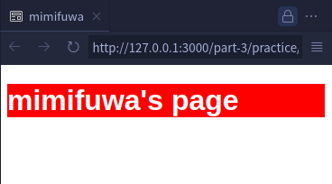
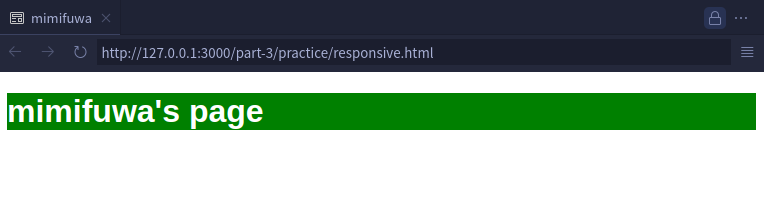
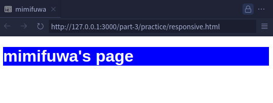

# スマホ対応をしてみよう

> ...今では利用できる端末はデスクトップ、ラップトップ、モバイル、タブレット、時計など多岐にわたるようになりました。いくつかの異なる画面サイズに合わせなければなりません...
> -- <cite>[レスポンシブデザイン - WEB 開発を学ぶ | MDN](https://developer.mozilla.org/ja/docs/Learn/CSS/CSS_layout/Responsive_Design)</cite>

というわけで、ここでは、スマホに限らず、様々な画面幅に対応したスタイルを CSS で記述する方法を学びます。

## `Viewport` について

Viewport（ビューポート）は、ユーザーがウェブページを表示するために使用するデバイスの表示領域のことです。

Viewport の設定には、HTML の`<meta>`タグを使用します。最も一般的に使用されるのは、以下のような設定です。

```html
<meta name="viewport" content="width=device-width, initial-scale=1.0" />
```

- `width=device-width` : ビューポートの幅をデバイスの幅に設定します。これにより、ページはデバイスの幅に合わせて縮小または拡大されます。
- `initial-scale=1.0` : ページの初期ズームレベルを 1.0（100%）に設定します。つまり、ページはそのままのサイズで表示されます。

これを設定しなかった場合、スマートフォンの画面幅を PC と同じとして扱ってしまうので、文字が非常に小さく表示されるなど、閲覧しにくいサイトになってしまいます。

Viewport を適切に指定することで、スマホでも PC でも（任意の画面幅の端末でも）正しいサイズで表示されるようになります。

## CSS メディアクエリ

CSS では、画面幅に応じて適応するスタイルを変更することができ、「CSS メディアクエリ」を用いることでこれを実現することができます。

画面幅に応じて適応するスタイルを変更するためには、以下のような CSS を記述します。

```css
@media (max-width: 600px) {
  /* 適応したいスタイルを記述 */
}
```

この場合、画面幅（Viewport）が 600 ピクセルより狭い場合（つまりとりうる画面幅の最大値が 600 ピクセルのとき）、この中に書かれたスタイルが適応されます。

逆に、画面幅が 600 ピクセルより広い場合（とりうる画面幅の最小値が 600 ピクセルのとき）のみスタイルを指定したいときは、

```css
@media (min-width: 600px) {
  /* 適応したいスタイルを記述 */
}
```

と記述することで実現できます。

## 実践

画面幅に応じて背景色を変える、という実装をしてみましょう。

```html
<!DOCTYPE html>
<html lang="ja">
  <head>
    <meta charset="UTF-8" />
    <meta name="viewport" content="width=device-width, initial-scale=1.0" />
    <title>[ここにあなたのGitHubユーザー名を入力]</title>
    <style>
      h1 {
        background-color: blue;
      }
      @media (max-width: 200px) {
        h1 {
          background-color: red;
        }
      }
      @media (min-width: 600px) {
        h1 {
          background-color: green;
        }
      }
    </style>
  </head>
  <body>
    <h1>[ここにあなたのGitHubユーザー名を入力]'s page</h1>
  </body>
</html>
```

この場合、画面幅が

- 200px 以下の場合: 背景が赤
- 600px 以上の場合: 背景が緑
- それ以外（200px より大きく 600px 未満）: 背景が青

のようにスタイルが適応されます。

#### 200px 以下の場合



#### 600px 以上の場合



#### それ以外（200px より大きく 600px 未満）の場合



本気でレスポンシブデザインを触ろうとすると、半年ほど沼から抜け出せなくなるので、ここで触るのはこれくらいにしておきますが、メディアクエリを応用することで、要素のレイアウトを変えたり、文字のサイズを変えられます。これで様々な端末で見やすいレスポンシブデザインを作ることができます！

## 練習問題

Q. 画面幅が 400 ピクセル以上のときに`<p>`タグの背景色を緑にする CSS はどちらですか？

A.

```css
@media (min-width: 400px) {
  p {
    background-color: green;
  }
}
```

B.

```css
@media (max-width: 400px) {
  p {
    background-color: green;
  }
}
```

<hr>
<br>

<details>
  <summary>A. が解答だと思ったらクリック</summary>
   正解です！ちゃんと理解できてますね。
</details>
<br>

<details>
  <summary>B. が解答だと思ったらクリック</summary>
   不正解です。とりうる画面幅の最小値が400px、と考えてみましょう。
</details>

## [発展] メディアクエリについて詳しく

実は、最も基本的なメディアクエリーの構文は次のようになります。

```css
@media media-type and (media-feature-rule) {
  /* CSS ルールをここに */
}
```

### メディア種別 (media-type)

このコードがどのようなメディア（例えば、印刷、画面）のためのものであるかをブラウザーに伝えます。

- `all`（すべて）
- `print`（印刷）
- `screen`（画面）

を指定することができます。

### メディア式・ルール (media-feature-rule)

先ほど説明した、画面幅などの条件を記述します。

この条件を満たすときのみ指定したスタイルが適応されます。

<br>

詳しく知りたい人は

- [メディアクエリーの初心者向けガイド - ウェブ開発を学ぶ | MDN](https://developer.mozilla.org/ja/docs/Learn/CSS/CSS_layout/Media_queries)

あたりを見ると良いと思います。
