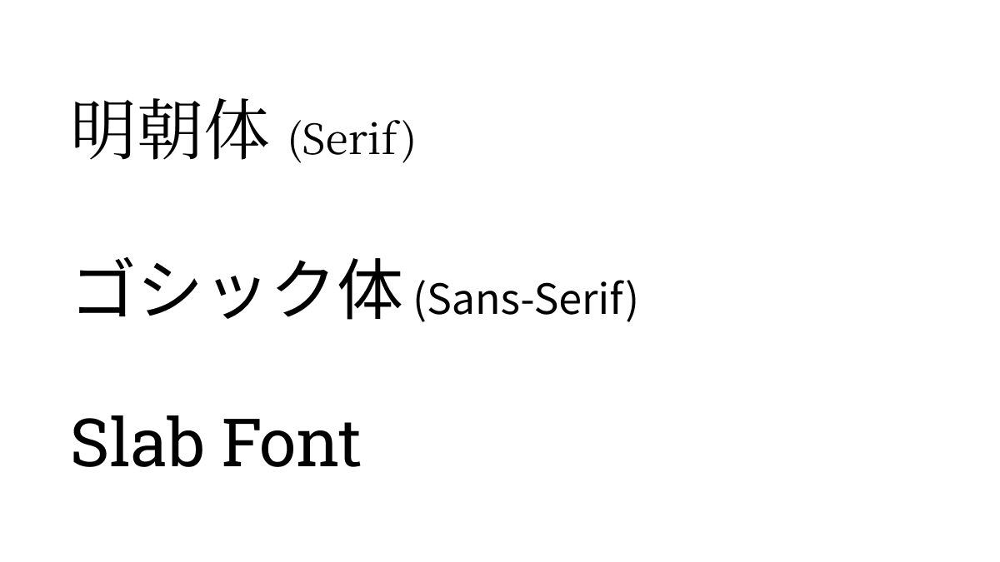
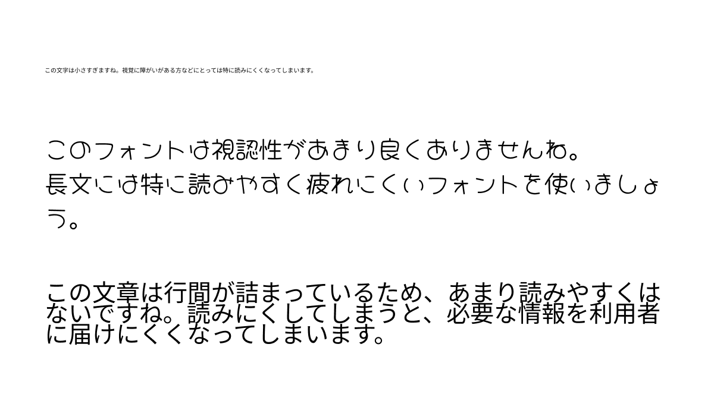
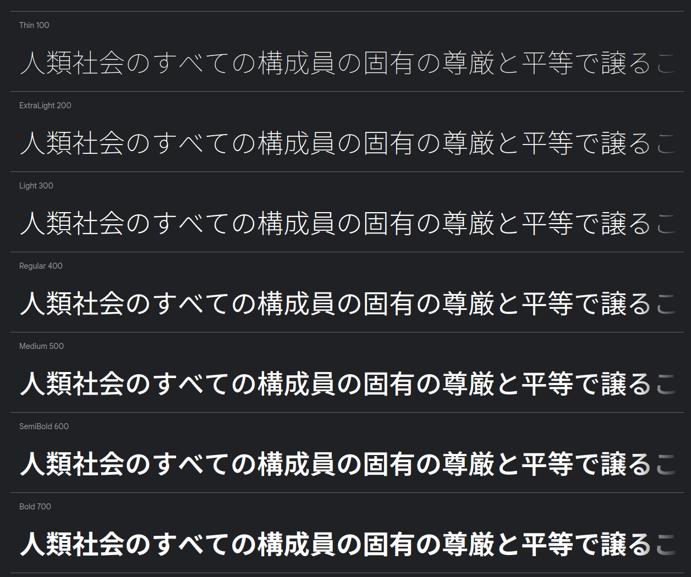
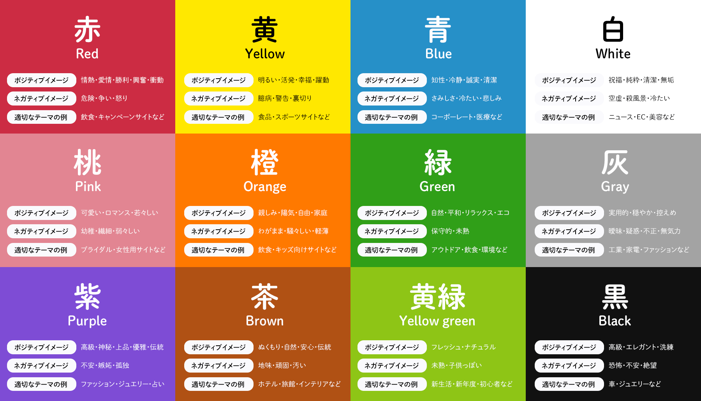
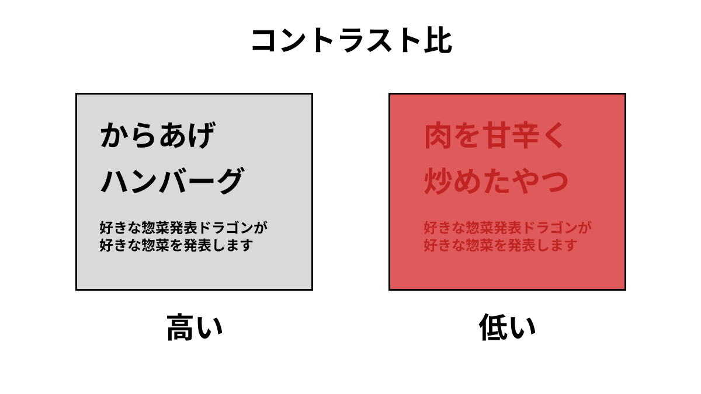
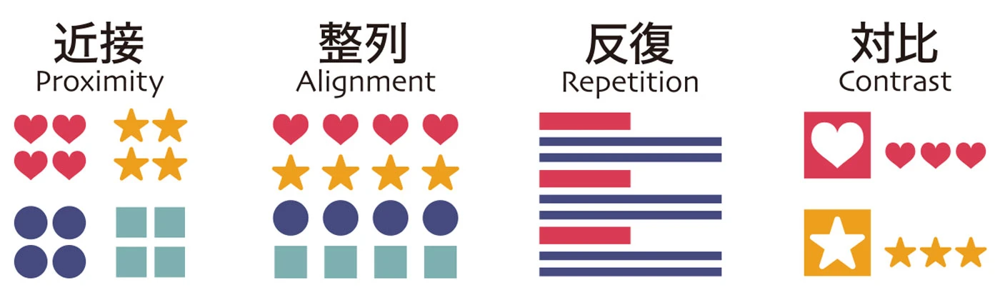
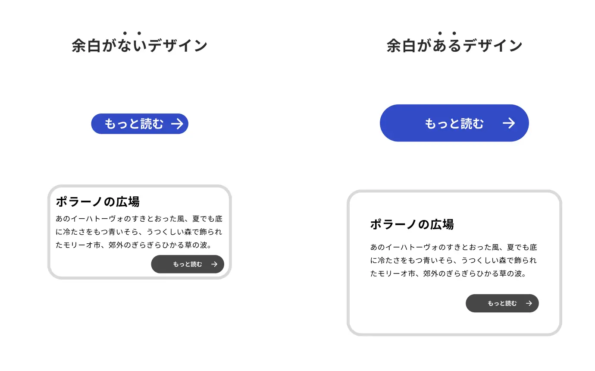

# 4-1. WEB デザインの基礎

ここでは、WEB サイトを作るうえで最低限必要なデザインの知識について紹介します。

あくまで最低限ですから、これで満足せず、良いデザインを追い求めるきっかけにしてください。

また、デザインには「これが絶対に正解」というものがない（と思っている）ので、これにとらわれず、様々なものを試してみて自分だけの素晴らしいデザインを作り上げていってください（ただ、各所で出てくるアクセシビリティの話については準拠することを強く推奨します）。

## そもそもデザインとは

> デザイン（英語: design、中: 設計）は目的設定・計画策定・仕様表現からなる一連のプロセスである。 すなわち人・ユーザー・社会にとって価値ある目的を見出し、それを達成できるモノゴトを計画し、他者が理解できる仕様として表現する、この一連の行為をデザインという。
>
> Wikipedia - https://ja.wikipedia.org/wiki/デザイン

> 「Design is not just what it looks like and feels like. Design is how it works.」
>
> 「デザインとは、単なる視覚や感覚のことではない。デザインとは、どうやって動くかだ。」
>
> スティーブ・ジョブズ - https://www.clairworks.com/words/detail/195

と言われてもなかなかピンとこないと思いますが、機能性を考えることがデザインでは重要だということです。

特に、WEB サイトなどのデザインには、高い機能性が求められます。

以下、デザインを考えるうえで重要な「フォント」「色」「レイアウト」の 3 つについて見ていきます。

## フォント

フォントには様々な種類があり、大きく「明朝体（Serif）」「ゴシック体（Sans-Serif）」「スラブ体」に分けられます。

WEB サイトでは、可読性向上のため、ゴシック体をメインで使用することをおすすめします。

### 可読性

読みにくいフォントを使用してしまうと、サイトの利用者が内容を理解するのに苦労します。長いテキストを使うときなどは特に可読性が高いフォントを選びましょう。

また、フォントのサイズにも注意が必要です。小さすぎると読みにくくなってしまいますが、大きすぎても見栄えが悪くなってしまいます。
本文の文字サイズは 16px〜18px くらいがちょうどよいでしょう。

さらに、行間・字間を適切に設定することでも読みやすさを向上することができます。

#### フォントの指定が適切でない例

これらの要素は、サイトのアクセシビリティに密接に関係しています。

### フォントの統一感

同一のフォントを使用することで、比較的簡単にページ全体で統一感を持たせることができます。

一つのフォントファミリー内でのバリエーション（太さやスタイル）を活用することで、統一感を保ちつつ、適度な変化をつけることができます。

#### Google Fonts のフォントファミリーの例

## 色

デザインにおいて色は、利用者の感情や行動に影響を与える重要な要素です。

以下、色を適切に扱うための知識を見ていきましょう。

### 色が与える影響

色は人間の感情や行動に大きく影響します。

例えば、青は信頼や平静を表し、赤は興奮や緊急性を表します。

その色が表す意味を理解し適切に用いることで、利用者を正しく誘導できるデザインを作ることができます。

### 色の調和

メインカラー、アクセントカラー、背景色などについて、調和の取れた色を使用することで、サイトに統一感を持たせることができます。

引用: https://blog.btrax.com/jp/color/

はじめのうちは（慣れてからももちろん）、Adobe Color などのツールを使って色の組み合わせを選ぶのも良いでしょう。

### アクセシビリティ

視覚的な障がいを持つ利用者にも読みやすくするため、背景色と文字色のコントラスト比を適切に設定することが重要です。

Web Content Accessibility Guidelines (WCAG) では、テキストと背景色のコントラスト比を 4.5:1 以上にすることを推奨しています。

## レイアウト

### 配置の 4 原則

コンテンツを配置する際は以下の 4 つのことに注意して行うと、見やすく意図も伝わりやすくなります。

- 近接　関連性の高いものを近くに配置しよう
- 整列　要素を揃えよう（左揃え、中央揃えなど）
- 反復　同じ要素を繰り返し利用しよう
- 対比　情報に優先順位をつけよう

参考: https://zenn.dev/arsaga/articles/0ec2e6eacd748e#%E3%83%87%E3%82%B6%E3%82%A4%E3%83%B3%E3%81%AE%EF%BC%94%E5%8E%9F%E5%89%87

引用: https://321web.link/design-4principles/

### 余白

良いデザインは余白の使い方が上手い（らしい）です。

適切に余白を用いる（例えば行間やなど）ことで、情報が伝わりやすくなります。

引用: https://giginc.co.jp/blog/giglab/yohaku-design

## 参考にできそうなサイト

デザインをしていく上で参考になりそうなサイトです。

今はたくさん記事が転がっていてとても便利ですね、それと比べて昔は少なかっｔ...（老害）

エンジニアこそ知っておくべきデザインの基礎まとめ 
https://zenn.dev/arsaga/articles/0ec2e6eacd748e

Google Fonts 
https://fonts.google.com/

Adobe Color 
https://color.adobe.com/ja/

レイアウトデザインの視点を増やす 思考＆Tips  
https://note.com/harahiroshi/n/n3af079dc17e9
