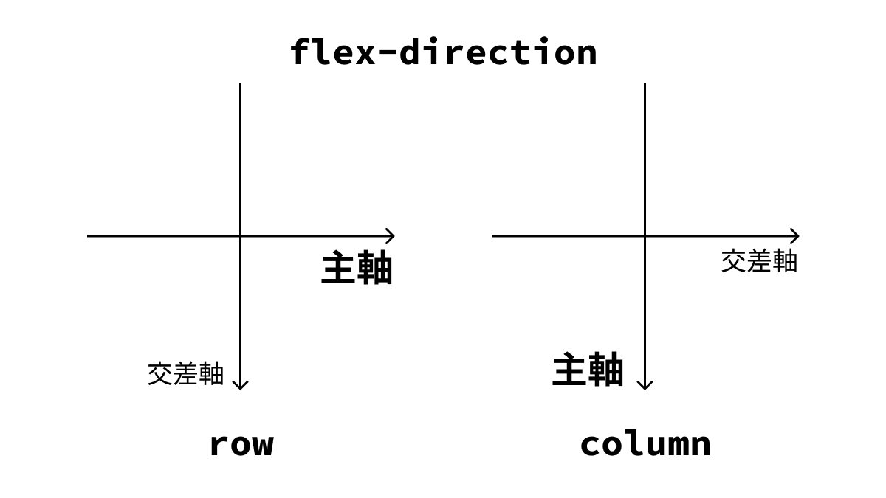
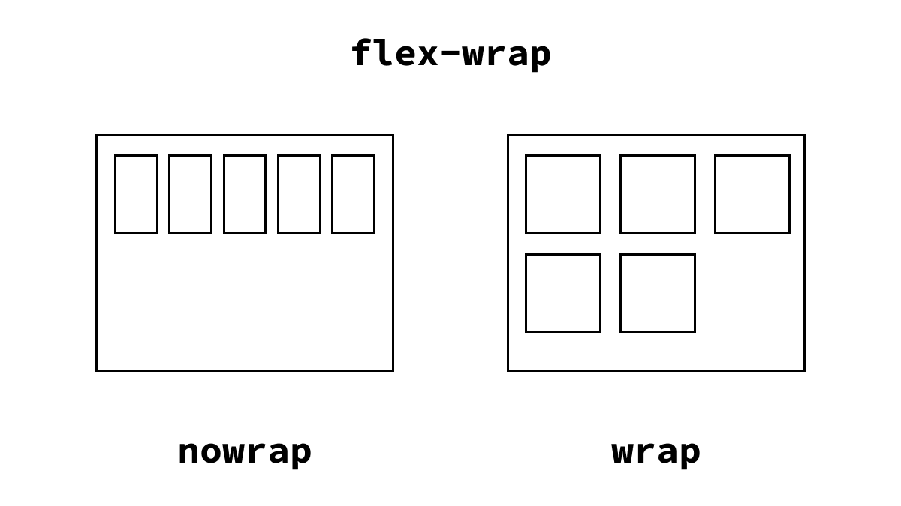
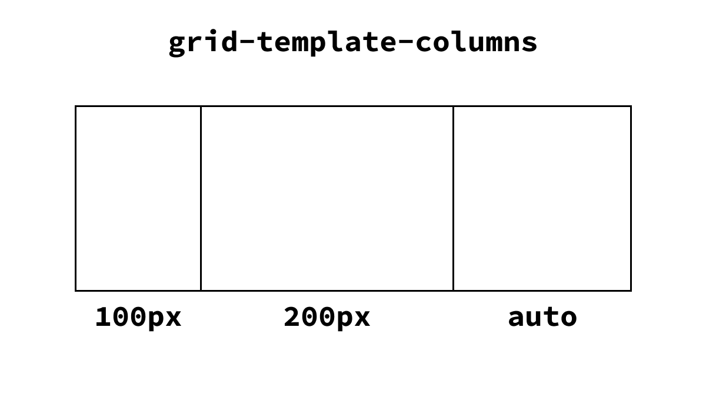
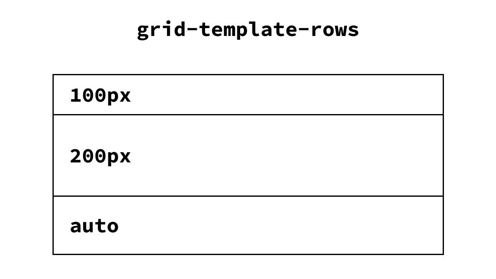
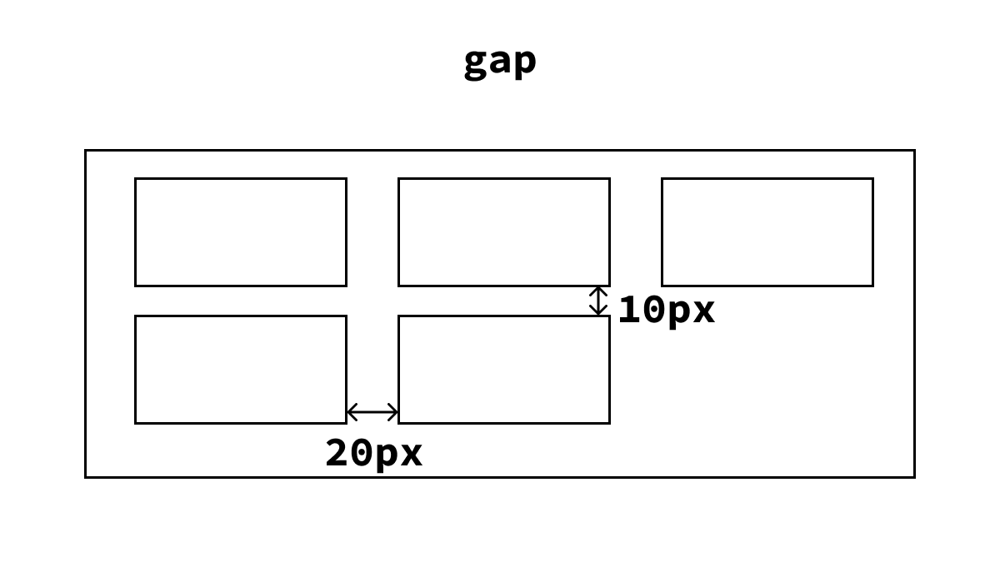

# 4-2. 実際に WEB サイトを作ろう（1/3）（Flexbox・Grid について）

前回まで、ちょっとした自分のサイトを作っていたと思いますが、今回は実際に WEB サイトを作っていく際の流れを感じてほしいので、一から電通大の HP もどきを作っていこうと思います。

最終的な目標は、こんな感じのものを作ることです。


...っとその前に、今回新しく使用する「Flexbox」と「Grid」について解説します。

## Flexbox（フレックスボックス）

「Flexible Box Layout」（フレキシブルボックスレイアウト）、「Flexbox」は、WEB ページのレイアウトを効率的にデザインするためのものです。

HTML 要素のレイアウトを正確に指定しようとすると、通常は px 単位での細かな記述が必要になります。
そこで Flexbox を使うことで、簡素な記述で 1 次元(縦方向または横方向)のレイアウトを作ることができます。

### フレックスコンテナ（Flex Container）

Flexbox のレイアウトを使用するために、フレックスコンテナを定義します。

`display: flex`（の他にも`display: inline-flex`） を使用することでフレックスコンテナを作成でき、このコンテナの中に配置される要素が次で説明するフレックスアイテムとなります。

#### 仕様例

```css
.container {
  display: flex;
}
```

### フレックスアイテム（Flex Item）

フレックスコンテナ内に直接含まれる子要素がフレックスアイテムになります（孫要素などはフレックスアイテムにならないことに注意）。

これらのアイテムは自動的にフレックスコンテナの中で整列されるため、並べ方の設定はフレックスコンテナの方に書いていきます。

### フレックスコンテナの主なプロパティ

#### `flex-direction`

アイテムを並べる方向を設定します。

- `row` : 横向き
- `row-reverse` : 横向き逆順
- `column` : 縦向き
- `column-reverse` : 縦向き逆順

を値に指定できます。
これで指定した向きに「主軸」、それに垂直に交差する向きに「交差軸」を定義して以下説明します。



#### `justify-content`

主軸に沿ったアイテムの配置を制御します。

#### `align-items`

交差軸に沿ったアイテムの配置を制御します。

#### `flex-wrap`

アイテムがコンテナの枠内に収まりきらない場合に、折り返すかどうかを設定します。



### もっと詳しく知りたい人は...

MDN のサイトを覗いてみてください。

- https://developer.mozilla.org/ja/docs/Web/CSS/flex

各種プロパティのとる値やその意味について理解することができると思います。

## Grid Layout（グリッドレイアウト）

Grid Layout(グリッドレイアウト)は WEB ページのレイアウトを２次元で管理することができる強力なツールです。

Flexbox は 1 次元（1 方向）でしかレイアウトを指定できませんでしたが、Grid を用いると 2 次元でレイアウトを指定することができます。

### グリッドコンテナ（Grid Cotainer）

グリッドコンテナを定義することで、グリッドレイアウトを使うことができます。`display: grid`（の他にも`display: inline-grid`）でグリッドコンテナを作成できます。

Flexbox と同様、コンテナの子要素がグリッドアイテムとなります。

アイテムの配置の設定については主にコンテナで行います。

### グリッドコンテナの主なプロパティ

#### `grid-template-columns`

グリッドコンテナの列の定義を行います。各列の幅を指定します。

仕様例

```css
.container {
  grid-template-columns: 100px 200px auto;
}
```



`grid-template-columns: 1fr 2fr 1fr;`のように指定すると、`1 : 2 : 1`になるように分割してくれます。

#### `grid-template-rows`

グリッドコンテナの行の定義を行います。各行の幅を指定します。

仕様例

```css
.container {
  grid-template-rows: 100px 200px auto;
}
```



`columns`の場合と同様、`fr`を使うことができます。

#### `gap`

グリッドアイテム間のスペースを指定します。行と列、別々に指定することもできます。

仕様例

```css
.container {
  column-gap: 20px;
  row-gap: 10px;
}
```



### もっと詳しく知りたい人は...

これについても MDN のサイトを覗いてみてください。

- https://developer.mozilla.org/ja/docs/Web/CSS/grid
