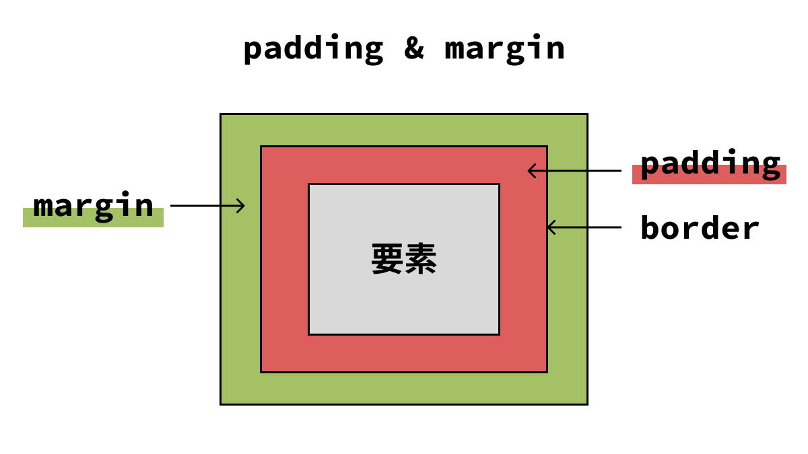

# CSS のプロパティについての補足説明

## `rem`について

CSS における `rem`（"root em"の略）は、フォントサイズや他の要素のサイズを相対的に指定するための単位です。これにより、ウェブサイトのデザインをより柔軟かつ一貫性のあるものにすることができます。

デバイスや画面サイズに応じてデザインを柔軟に調整することができるため、レスポンシブデザインに対応しやすいです。

### 基本単位の解説

`px`（ピクセル）:
固定単位で、画面上の物理的なピクセル数に基づきます。例えば、`1px`は常に 1 ピクセルです。
主に精密なコントロールが必要な場合に使用されますが、デバイス間の一貫性を保つのが難しいことがあります。

`em`:
相対単位で、親要素のフォントサイズに基づきます。例えば、親要素のフォントサイズが`16px`であれば、`1em`は`16px`に相当します。
ネストされた要素の場合、相対サイズが累積するため、サイズ計算が複雑になることがあります。

`rem`:
相対単位で、ルート要素（通常は HTML 要素）のフォントサイズに基づきます。例えば、ルート要素のフォントサイズが`16px`であれば、1rem は常に`16px`に相当します。
ページ全体で一貫した相対サイズを維持できるため、デザインの一貫性が高まります。

### 使用例

```html
<!DOCTYPE html>
<html>
  <head>
    <style>
      :root {
        font-size: 16px; /* 基本フォントサイズを指定 */
      }
      h1 {
        font-size: 2rem; /* 32px */
      }
      p {
        font-size: 1rem; /* 16px */
      }
      .small-text {
        font-size: 0.75rem; /* 12px */
      }
    </style>
  </head>
  <body>
    <h1>見出し1</h1>
    <p>これは段落です。</p>
    <p class="small-text">これは小さいテキストです。</p>
  </body>
</html>
```

## `padding`と`margin`の違いについて

`padding`（内側の余白）

意味:
要素の内容（テキストや画像など）と要素の境界線（`border`）との間の内側の余白を設定します。

影響範囲:
要素の内部空間に影響を与えます。つまり、要素のコンテンツが四方にどれだけの余白を持つかを決定します。

ビジュアル:
`padding` は背景色の一部と見なされるため、要素の背景色が `padding` にも適用されます。

`margin`（外側の余白）

意味:
要素と要素の外部との間の外側の余白を設定します。

影響範囲:
要素自体の外部空間に影響を与えます。つまり、要素が他の要素とどれだけ離れて配置されるかを決定します。

ビジュアル:
`margin` は要素の背景色とは無関係で、要素の外側に透明なスペースを作ります。


